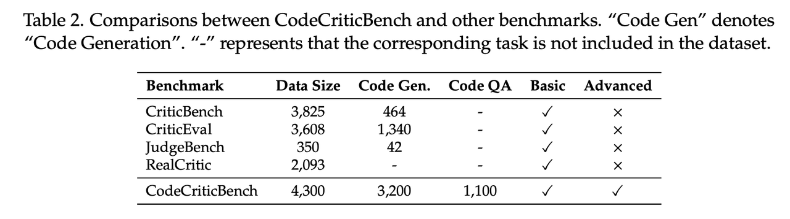
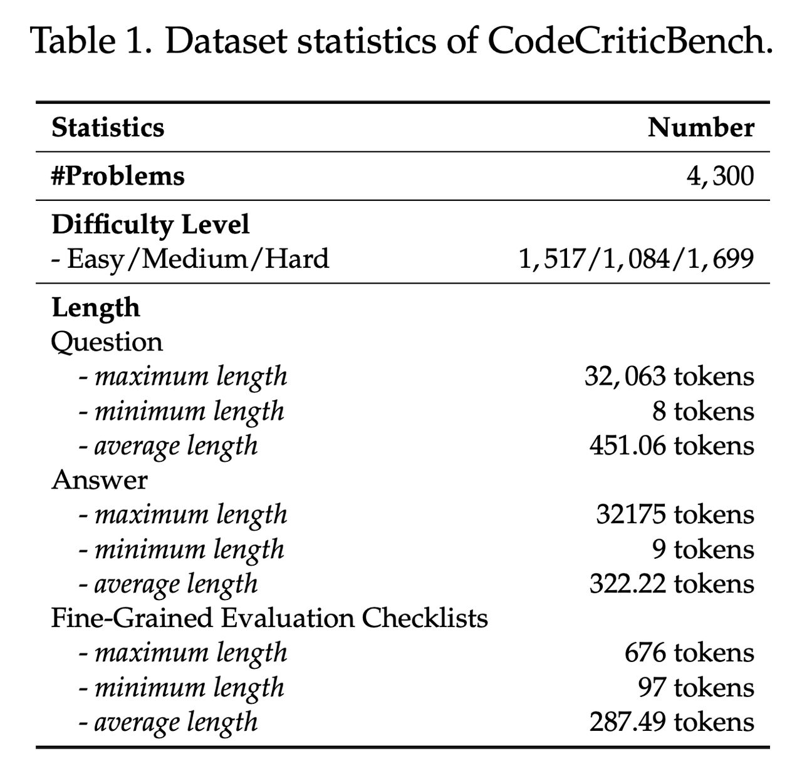
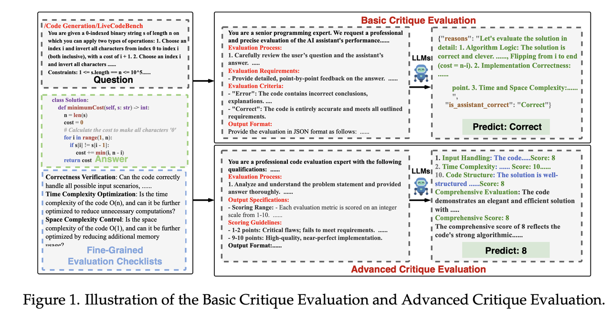
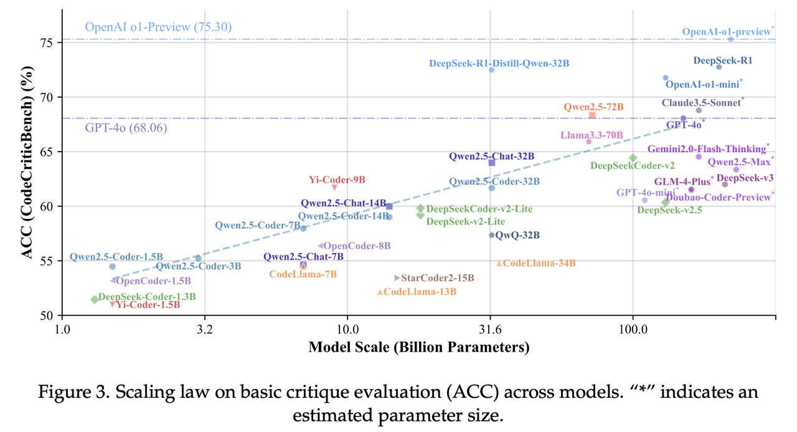
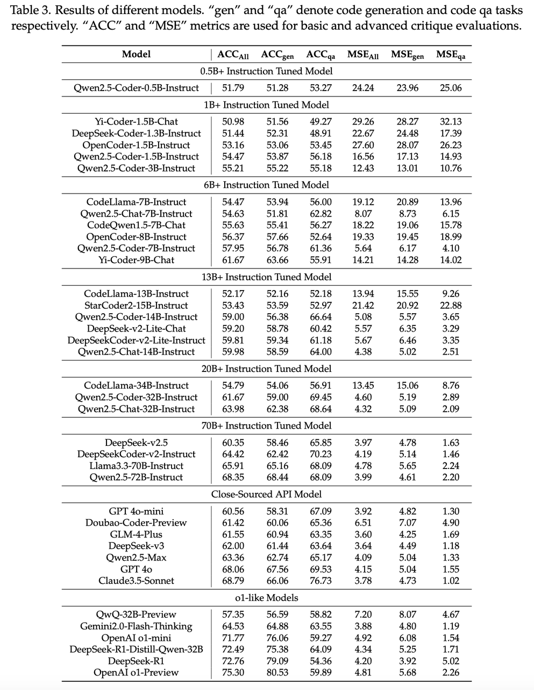

# CodeCriticBench: A Holistic Benchmark for Code Critique in LLMs
## 💥 Introduction
**CodeCriticBench** is a comprehensive benchmark designed to systematically evaluate the critique capabilities of large language models (LLMs) in both code generation and code-question answering tasks. Beyond focusing on code generation, this benchmark extends to code-related questions, offering multidimensional and fine-grained evaluation criteria to rigorously assess LLMs' reasoning and code comprehension abilities.
## ✨ Key Features
- **Multitask Coverage**
  - **Code Generation**: Includes algorithmic problems from common platforms (e.g., CodeForces, MBPP, LiveCodeBench), alongside a specialized Debug subset to evaluate the model's ability to detect specific programming errors.
  - **Code Question Answering (Code QA)**: Based on real-world programming scenarios, combining StackOverflow responses and diverse question generation from Qwen2.5-72B to assess performance in realistic situations.
- **Fine-grained Evaluation Mechanism**
 Each sample is accompanied by a series of meticulously designed evaluation checklists covering 10 distinct criteria. In addition to basic evaluations, advanced assessment protocols ensure a multi-angle, layered assessment of the model's output quality.
- **Difficulty Stratification**
 Using 12 state-of-the-art LLMs, each sample is categorized by difficulty into three levels: Easy (1,517 samples), Medium (1,084 samples), and Hard (1,699 samples). This ensures a balanced distribution across difficulty levels.
- **Automated and Manual Labeling**
  - **Automated Evaluation**: Code generation tasks are paired with test cases to automatically validate code correctness within a sandbox environment.
  - **Manual Evaluation**: Code QA tasks involve 20 volunteers with programming experience who independently assess answers, with final labels determined via majority voting.

<div align="center">




</div>

## 🌸 Framework Overview

<div align="center">

</div>


## 🌸 Usage
To get started with **CodeCriticBench**, clone the repository and follow these steps:
```bash
git clone https://github.com/xxzcc/CodeCriticBench.git
cd CodeCriticBench
```
## 💻 Run Evaluation Script
Use the provided evaluation scripts for automated and manual assessment of model outputs. For example:
- **Model Inference**: Run inference on your model:
```bash
python src/infer_qwen.py --model_name 'Qwen2.5-Coder-32B-Instruct' --model_path='./Qwen2.5-Coder-32B-Instruct' --input_data_path='./data/CodeCriticBench.jsonl' --output_data_path='./data/output/'
```
- **Score Evaluation**: Score the model outputs:
```bash
python src/evaluate.py
```
## 📰 Evaluation Results
Evaluation results will be displayed as follows:

<div align="center">




</div>

## 🔥 Contributing
We welcome contributions to CodeCriticBench! Whether it's expanding the dataset, improving evaluation metrics, or optimizing code, your input is highly valued.


## 📜 Citation
If you use CodeCriticBench in your research, please cite the following:
```bibtex
@misc{zhang2025codecriticbenchholisticcodecritique,
      title={CodeCriticBench: A Holistic Code Critique Benchmark for Large Language Models},
      author={Alexander Zhang and Marcus Dong and Jiaheng Liu and Wei Zhang and Yejie Wang and Jian Yang and Ge Zhang and Tianyu Liu and Zhongyuan Peng and Yingshui Tan and Yuanxing Zhang and Zhexu Wang and Weixun Wang and Yancheng He and Ken Deng and Wangchunshu Zhou and Wenhao Huang and Zhaoxiang Zhang},
      year={2025},
      eprint={2502.16614},
      archivePrefix={arXiv},
      primaryClass={cs.CL},
      url={https://arxiv.org/abs/2502.16614},
}
```


## Contact
If you have any questions or suggestions, feel free to reach out via the issues page.
If you have any questions or suggestions, feel free to reach out via the [issues page](https://github.com/xxzcc/CodeCriticBench/issues).

---
CodeCriticBench is dedicated to advancing the field of code understanding and critique within LLMs. We look forward to your usage and feedback!
