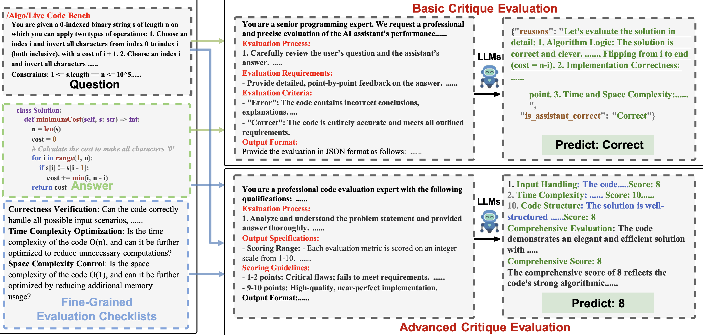
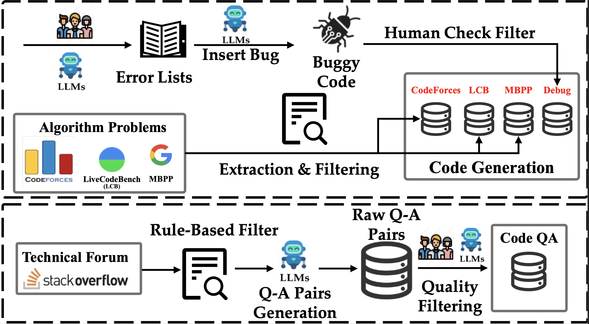
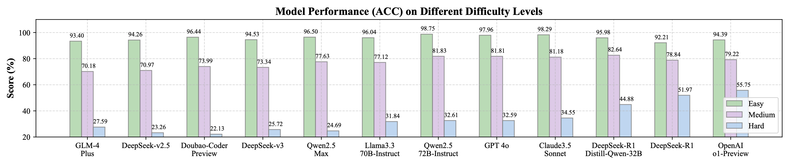
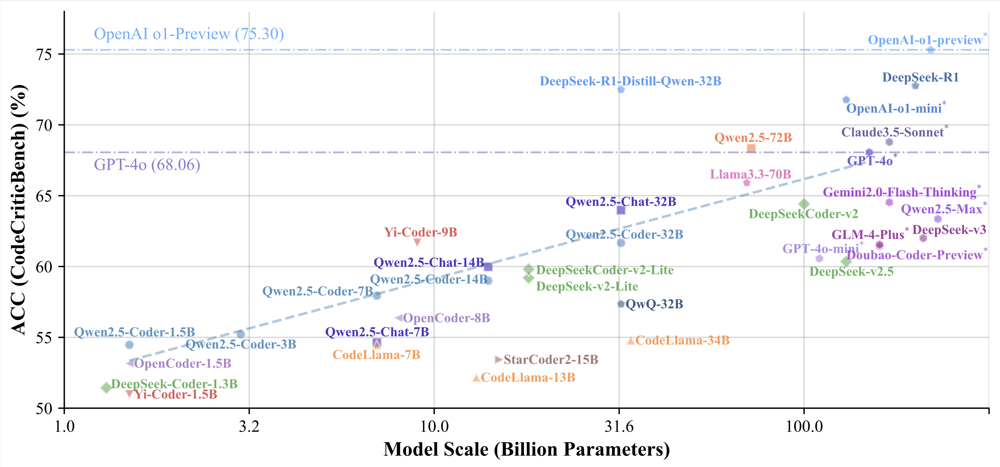
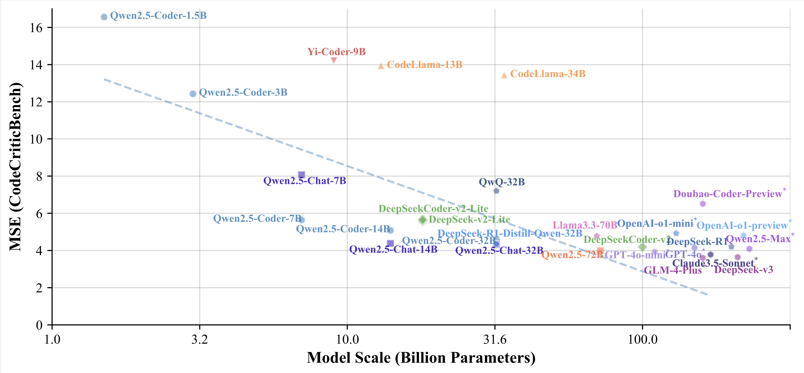

# CodeCriticBench: A Holistic Code Critique Benchmark for Large Language Models

<div align="center">

[](https://arxiv.org/abs/2502.16614) 
[](./LICENSE)
[](https://huggingface.co/datasets/m-a-p/CodeCriticBench)

</div>

## 💥 Introduction
**CodeCriticBench** is a comprehensive benchmark designed to systematically evaluate the critique capabilities of large language models (LLMs) in both code generation and code-question answering tasks. Beyond focusing on code generation, this benchmark extends to code-related questions, offering multidimensional and fine-grained evaluation criteria to rigorously assess LLMs' reasoning and code comprehension abilities.

<div align="center">

</div>

## ✨ Key Features
- **Multitask Coverage**
  - **Code Generation**: Includes algorithmic problems from common platforms (e.g., CodeForces, MBPP, LiveCodeBench), alongside a specialized Debug subset to evaluate the model's ability to detect specific programming errors.
  - **Code Question Answering (Code QA)**: Based on real-world programming scenarios, combining StackOverflow responses and diverse question generation from Qwen2.5-72B to assess performance in realistic situations.
- **Fine-grained Evaluation Mechanism**
 Each sample is accompanied by a series of meticulously designed evaluation checklists covering 10 distinct criteria. In addition to basic evaluations, advanced assessment protocols ensure a multi-angle, layered assessment of the model's output quality.
- **Difficulty Stratification**
 Using 12 state-of-the-art LLMs, each sample is categorized by difficulty into three levels: Easy (1,517 samples), Medium (1,084 samples), and Hard (1,699 samples). This ensures a balanced distribution across difficulty levels.
- **Automated and Manual Labeling**
  - **Automated Evaluation**: Code generation tasks are paired with test cases to automatically validate code correctness within a sandbox environment.
  - **Manual Evaluation**: Code QA tasks involve 20 volunteers with programming experience who independently assess answers, with final labels determined via majority voting.


## 🌸 Framework Overview

<div align="center">

</div>

## 📊 Main Results

Here are some of the main results from the paper, showcasing the performance of various models on CodeCriticBench.

<div align="center">

</div>

The scaling laws for both Basic Critique Evaluation (ACC) and Advanced Critique Evaluation (MSE) are presented below, demonstrating a clear trend of performance improvement with increasing model size.

<div align="center">


</div>


## 💻 Usage
To get started with **CodeCriticBench**, clone the repository and follow these steps:
```bash
git clone https://github.com/multimodal-art-projection/CodeCriticBench.git
cd CodeCriticBench
```
## 🚀 Run Evaluation Script
Use the provided evaluation scripts for automated and manual assessment of model outputs. For example:
- **Model Inference**: Run inference on your model:
```bash
src/output_claude35.jsonl
The question field in the src/src/output_claude35.jsonl file is the input to the model.
The generated field in the src file is the output sent to the model

src/output_claude35.jsonl
{
    'question':xxx,   # model input
    'generated': xxx, # model output
    ..., # Data other details
}
The dataset has a total of 9,000 records, of which 4,300 are level 1, 4,300 are level 2, and 400 are level 3.

```
- **Score Evaluation**: Score the model outputs:
```bash
cd src
wget https://huggingface.co/datasets/m-a-p/CodeCriticBench/resolve/main/source/output_claude35.jsonl
python3 eval_all_end_to_end.py
```

The output for Claude 3.5 Sonnet will look like this:

```
Input File: ./output_claude35.jsonl
-------------------- Basic Evaluation ACC (%) --------------------
+-------+---------+---------+
|  All  | CodeGen | Code QA |
+-------+---------+---------+
| 68.79 |  66.06  |  76.73  |
+-------------------------------------------+
| MBPP  | CodeForce | LiveCodeBench | Debug |
+-------+-----------+---------------+-------+
| 58.00 |   70.88   |     68.88     | 66.50 |
+---------------------------------------------------------------------------------------+
|  FP   |  AP   |  SE   |  DA   |  MA   |  DW   |  ML   |  SC   |  DB   |  MM   |  OS   |
+-------+-------+-------+-------+-------+-------+-------+-------+-------+-------+-------+
| 73.00 | 87.00 | 78.00 | 75.00 | 87.00 | 70.00 | 80.00 | 78.00 | 70.00 | 86.00 | 60.00 |
+-------+-------+-------+-------+-------+-------+-------+-------+-------+-------+-------+

-------------------- Advanced Evaluation MSE --------------------
+-------+---------+---------+
|  All  | CodeGen | Code QA |
+-------+---------+---------+
|  3.78 |   4.73  |   1.02  |
+-------------------------------------------+
| MBPP  | CodeForce | LiveCodeBench | Debug |
+-------+-----------+---------------+-------+
|  3.66 |    5.26   |      5.29     |  4.70 |
+---------------------------------------------------------------------------------------+
|  FP   |  AP   |  SE   |  DA   |  MA   |  DW   |  ML   |  SC   |  DB   |  MM   |  OS   |
+-------+-------+-------+-------+-------+-------+-------+-------+-------+-------+-------+
|  1.73 |  0.76 |  1.07 |  0.81 |  1.06 |  1.04 |  1.19 |  0.87 |  0.85 |  0.82 |  1.02 |
+-------+-------+-------+-------+-------+-------+-------+-------+-------+-------+-------+
For more fine-grained subset across different dimensions, split data according to subset name and dimension name

-------------------- Debug Evaluation Pass@1 ACC --------------------
+-------+-------+-------+-------+-------+-------+-------+-------+
|  All  |  CME  |  DME  | IVDPE | MLME  |  EVE  |  DME  |  SE   |
+-------+-------+-------+-------+-------+-------+-------+-------+
| 54.00 |  0.00 |  3.64 | 33.33 |  5.56 | 10.00 | 16.67 | 14.29 |
+-------+-------+-------+-------+-------+-------+-------+-------+
|  DF   |  SV   |  LSI  |  RE   |  SME  |  CQME |  LE   |  TVE  |
+-------+-------+-------+-------+-------+-------+-------+-------+
| 18.42 | 47.27 |  0.00 | 41.25 |  9.52 | 12.24 | 22.97 |  5.26 |
+-------+-------+-------+-------+-------+-------+-------+-------+
|  NCE  |  EHE  |  UPAE |  FIE  |  TE   |  ILE  |  PI   |  CME  |
+-------+-------+-------+-------+-------+-------+-------+-------+
|  3.28 |  4.76 | 15.62 |  1.37 | 26.19 |  7.35 | 29.89 | 75.00 |
+-------+-------+-------+-------+-------+-------+-------+-------+
```

## 🔥 Contributing
We welcome contributions to CodeCriticBench! Whether it's expanding the dataset, improving evaluation metrics, or optimizing code, your input is highly valued.


## 📜 Citation
If you use CodeCriticBench in your research, please cite the following:
```bibtex
@misc{zhang2025codecriticbenchholisticcodecritique,
      title={CodeCriticBench: A Holistic Code Critique Benchmark for Large Language Models},
      author={Chenchen Zhang and Jinxiang Xia and Jiaheng Liu and Wei Zhang and Yejie Wang and Jian Yang and Ge Zhang and Tianyu Liu and Zhongyuan Peng and Yingshui Tan and Yuanxing Zhang and Zhexu Wang and Weixun Wang and Yancheng He and Ken Deng and Wangchunshu Zhou and Wenhao Huang and Zhaoxiang Zhang},
      year={2025},
      eprint={2502.16614},
      archivePrefix={arXiv},
      primaryClass={cs.CL},
      url={https://arxiv.org/abs/2502.16614},
}
```


## Contact
If you have any questions or suggestions, feel free to reach out via the [issues page](https://github.com/multimodal-art-projection/CodeCriticBench/issues).

---
CodeCriticBench is dedicated to advancing the field of code understanding and critique within LLMs. We look forward to your usage and feedback!
